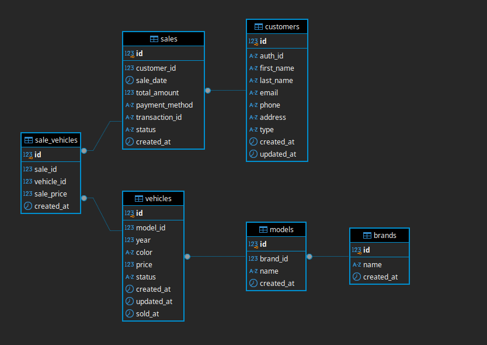

# TRABALHO SUB TECH CHALLENGE CURSO SOAT – PÓSTECH

## configurações
### executar localmente utilizando docker compose na raiz deste projeto

1. gerar arquivo src/main/resources/application-dev.properties com o seguinte conteúdo:
   ```properties
    # auth
    auth.client-id=AbWDEBmr3kAI1eaxBC4PLsGIYXhFtGFD
    auth.client-secret=NwC9nvjve13HAHbB-SdCa6eOH6v56SBu76FlP-7ZBIgc-7ntXz-sVoGT9EBh7LNt
    
    # DB
    spring.datasource.url=jdbc:postgresql://localhost:5432/veiculos_db
    spring.datasource.username=admin
    spring.datasource.password=123456
   ```
   
obs.: habilitar perfil dev para sobrescrever as configurações em application.properties, incluindo a propriedade **spring.profiles.active=dev** ou no script de execução - ./mvnw spring-boot:run -Dspring-boot.run.arguments="--spring.profiles.active=dev"

2. criar novo arquivo .env com o seguinte conteúdo:

```
DB_USERNAME=admin
DB_PASSWORD=123456
DB_NAME=veiculos_db
```

3. criar rede do docker com comando abaixo:
   > docker network create localnet
   
4. executar docker compose:
   > docker compose up -d

5. acessar endereço do frontend: http://localhost:8080


### estrutura do projeto
```
├── config/   
├── domain/   
│   ├── model/   
│   ├── exception/   
│   ├── repository/  
│   └── service/   
├── application/   
│   ├── service/   
├── infrastructure/   
│   ├── persistence/   
│   │   ├── entity/   
│   │   ├── repository/   
│   │   └── adapter/   
│   ├── web/   
│   │   ├── controller/   
│   │   ├── dto/
│   │   ├── mapper/   
│   │   └── events/   
 
```

### banco de dados



### API 
- [swagger](http://localhost:8080/swagger-ui/index.html)

### LINKS
- auth0 - https://auth0.com/docs/quickstart/backend/java-spring-security5/01-authorization
- auth0 com google - https://auth0.com/docs/quickstart/webapp/java-spring-boot/interactive

### PENDENCIAS
- [x] integrar auth0 com autenticação de terceiros, com google ou github
- [x] obter dados do usuario após o login e gravar na tabela
- [x] criar perfis de usuario: administrador e cliente(não pode alterar tabelas)