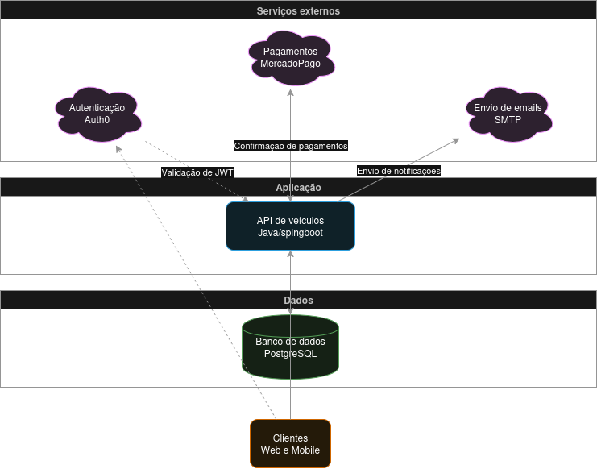
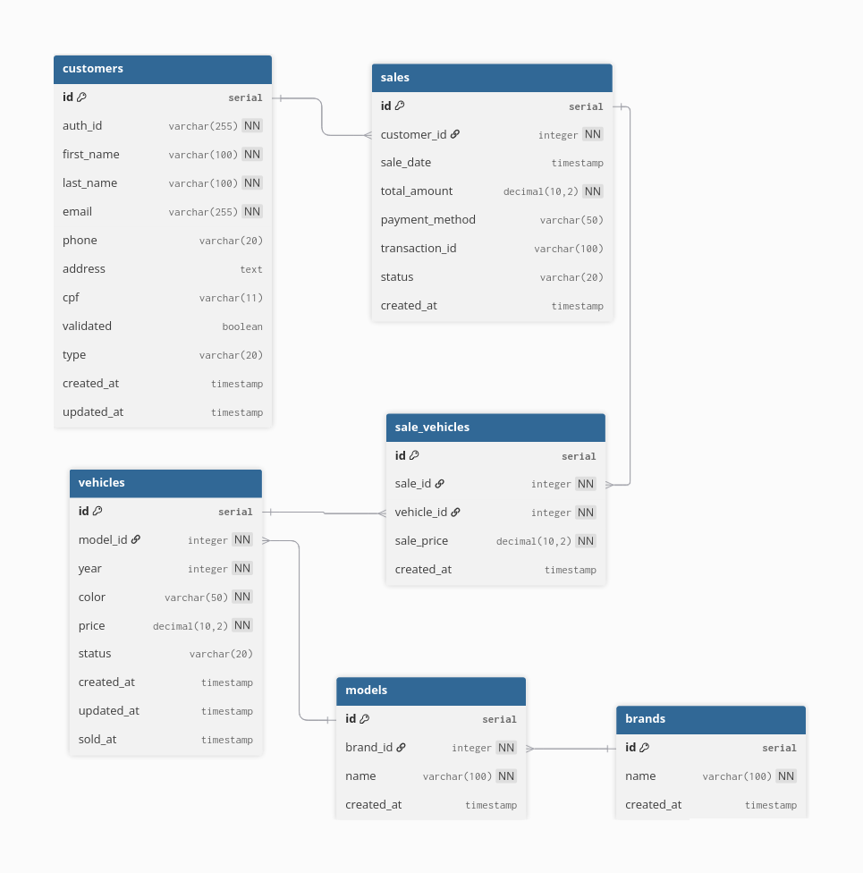

# TRABALHO SUB TECH CHALLENGE CURSO SOAT – PÓSTECH

## Diagramas

### arquitetura



### Banco de dados



## estrutura do projeto
```
├── config/   
├── domain/   
│   ├── model/   
│   ├── exception/   
│   ├── repository/  
│   └── service/   
├── application/   
│   ├── service/   
├── infrastructure/   
│   ├── persistence/   
│   │   ├── entity/   
│   │   ├── repository/   
│   │   └── adapter/   
│   ├── web/   
│   │   ├── controller/   
│   │   ├── dto/
│   │   ├── mapper/   
│   │   └── events/   
 
```
## Pilha de tecnologias utilizada
- Java 21
- Springboot 3.5.5
- Docker e Docker Compose
- Banco de dados postgreSQL

## configurações
### Pré-requisitos
Para executar localmente, execute os passos a seguir:   
1. Configurar conta no auth0 conforme descrito [neste link](https://auth0.com/docs/quickstart/backend/java-spring-security5/01-authorization)
2. Configurar conta no mercado pago conforme descrito [neste link](https://www.mercadopago.com.br/developers/pt/docs/checkout-pro/create-application)
3. Criar nova senha de app no gmail para usa-lo como servidor SMTP, [neste link](https://myaccount.google.com/apppasswords)
4. Instalar e configurar o ngrok conforme descrito [neste link](https://ngrok.com/docs/getting-started)

### Executar o projeto localmente sem docker compose
1. criar rede do docker com comando abaixo:
> docker network create localnet
2. iniciar base de dados
> docker compose up -d db
3. gerar arquivo src/main/resources/application-dev.properties com o seguinte conteúdo:
   ```properties
    # auth
    okta.oauth2.client-id=${ID_APP_AUTH0}
    okta.oauth2.client-secret=${SECRET_APP_AUTH0}
    # DB
    spring.datasource.url=jdbc:postgresql://localhost:5432/veiculos_db
    spring.datasource.username=admin
    spring.datasource.password=123456
    # servidor smtp - email
    spring.mail.username=${ENDERECO_GMAIL}
    spring.mail.password=${SENHA_APP_GMAIL}
    # mercado pago
    mercadopago.access-token=${ACCESS_TOKEN_MERCADO_PAGO}
    mercadopago.base-url=https://api.mercadopago.com
   ```
obs.: Sobrescrever as configurações em application.properties, incluindo a propriedade **spring.profiles.active=dev** ou no script de execução - ./mvnw spring-boot:run -Dspring-boot.run.arguments="--spring.profiles.active=dev"

4. acessar endereço do frontend: http://localhost:8080 efetuando o login

5. acessar api do swagger no endereço http://localhost:8080/swagger-ui/index.html


### Executar localmente com docker compose na raiz deste projeto

1. criar novo arquivo .env que será utilizado pelo docker-compose com o seguinte conteúdo:

```
DB_USERNAME=admin
DB_PASSWORD=123456
DB_NAME=veiculos_db
AUTH0_CLIENT_ID=${ID_APP_AUTH0}
AUTH0_CLIENT_SECRET=${SECRET_APP_AUTH0}
EMAIL_SENDER_FROM=${ENDERECO_GMAIL}
EMAIL_SENDER_PASSWORD=${SENHA_APP_GMAIL}
MERCADO_LIVRE_PASS=${ACCESS_TOKEN_MERCADO_PAGO}
```
2. criar rede do docker com comando abaixo:
> docker network create localnet
3. iniciar base de dados e app
> docker compose up -d
4. iniciar ngrok e incluir o endereço em  Notificações > Webhook > URL configurada do painel do desenvolvedor do [mercado pago](https://www.mercadopago.com.br/developers/pt) 
> ngrok http 8080
5. acessar endereço do frontend: http://localhost:8080 efetuando o login
6. acessar api do swagger no endereço http://localhost:8080/swagger-ui/index.html


### API 
- [swagger](http://localhost:8080/swagger-ui/index.html)
